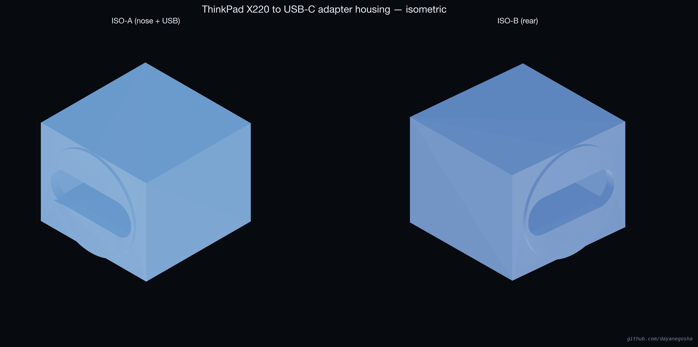

# ThinkPad X220 USB-C power jack housing

<p align="center">
  
</p>

Author: [@dayanegosha](https://github.com/dayanegosha)

**English.** A printable replacement **housing** for the ThinkPad **X220** palmrest **DC power jack**. It accepts a small **USB-C PD trigger board** (PDC004 family) so you can power the laptop from a **USB-C charger at 20 V**. The design is **power-only** (no USB data). The repo ships a ready-made **[`stl/X220_USB_C_adapter.stl`](stl/X220_USB_C_adapter.stl)**, this README, and **[`src/adapter.py`](src/adapter.py)** to tweak dimensions and regenerate the mesh.

**Русский.** **Печатаемая деталь** — **замена корпуса** **цилиндрического разъёма питания** в **верхней крышке с клавиатурой (palmrest)** ноутбука **ThinkPad X220**. Внутрь устанавливается компактная плата **USB-C PD-триггера** (семейство **PDC004**): ноутбук получает **20 В** от обычного **USB-C**-зарядного устройства по протоколу **Power Delivery**. **По USB передаётся только питание**, линии данных не используются — по смыслу то же, что и у штатного круглого разъёма. В репозитории лежат готовый **[`stl/X220_USB_C_adapter.stl`](stl/X220_USB_C_adapter.stl)**, этот README и **[`src/adapter.py`](src/adapter.py)** — для правки размеров и **повторного экспорта** STL.

---

## Just want to print it?

1. Download [`stl/X220_USB_C_adapter.stl`](stl/X220_USB_C_adapter.stl).
2. Print in **PETG** or **ABS** (PLA is possible but softens earlier when the board warms up).
3. Place the part with the **open board pocket flat on the bed** so the **USB-C slot lies horizontally** — **supports off**.
4. Use a **PDC004** (or equivalent) trigger board in the common **~16.3 × 10.2 mm** “WITRN-style” footprint, solder the **X220 DC cable** to the board outputs, insert the board **from the front**, optionally glue or pot the rear, and clip the assembly into the palmrest like the original yellow jack body.

If fit is tight or loose, edit the constants at the top of `src/adapter.py` and run [Rebuild](#rebuild).

---

## Technical drawings (PNG)

In [`docs/`](docs/):

- [`drawing_views.png`](docs/drawing_views.png) — six orthographic views  
- [`drawing_isometric.png`](docs/drawing_isometric.png) — two isometric views  

There are **no bundled photos** of a printed sample; you can add your own images under `docs/` in a fork if you like.

---

## Table of contents

- [English](#english)
- [Русский](#русский)
- [License](#license)

---

# English

## What this is

This project is a **parametric 3D-printed shell** that fits the **X220 palmrest DC jack opening** and holds a **USB-C PD decoy/trigger PCB** so the machine negotiates **20 V PD** from a standard USB-C supply. You **reuse the laptop’s DC harness and motherboard connector**; only the **yellow plastic jack shell** is replaced by this print plus the trigger board.

Typical boards are **PDC004** or close clones; always match **board outline and pinout** to your seller’s datasheet.

## Outer dimensions (from `adapter.py`)

| | |
| --- | ---: |
| Width × height (X × Z) | **12.0 × 9.7 mm** |
| Depth into laptop (rectangular insert) | **11.2 mm** |
| Extra material on ring side only | **+0.7 mm** |
| Front ring | **Ø9.7 mm**, **1.0 mm** above the front face |
| Approx. length, nose tip → rear | **~12.2 mm** |
| USB-C opening in print (with clearance) | **9.16 × 3.36 mm** (corner radius **1.6 mm**) |
| Board pocket (approx.) | **10.35 × ~11.8 × 4.55 mm** |

## Bill of materials

| Qty | Item |
| ---: | --- |
| 1 | **PDC004-class** USB-C PD trigger PCB, about **16.3 × 10.2 × 1.0 mm** — verify against the seller drawing |
| 1 | [`stl/X220_USB_C_adapter.stl`](stl/X220_USB_C_adapter.stl) |
| 1 | Stock **X220 / X230 DC cable** with motherboard plug |
| — | Wire, solder, flux, fine tip, heat-shrink; optional epoxy or hot-melt for strain relief |

## Recommended print settings

| | |
| --- | --- |
| Material | **PETG** or **ABS** |
| Nozzle | 0.4 mm |
| Layer height | 0.12–0.16 mm |
| Perimeters | **≥ 3** |
| Infill | **100 %** |
| Top / bottom shells | **4** layers each |
| Supports | **Off** |
| Orientation | **Pocket opening on the build plate**, USB slot **horizontal** |

Thin walls: calibrate extrusion and use at least three perimeters.

## Assembly

1. Print the part; remove stringing and clean the pocket if needed.  
2. Remove the old jack from the **yellow housing** and keep the **cable**.  
3. Solder the cable to the trigger board **positive and negative outputs** in the same polarity as the original jack (**OUT+** / **OUT−** or equivalent per your board).  
4. Slide the PCB in **front edge first** until it seats; the USB-C shell should align with the slot in the print.  
5. Dry-fit in the palmrest before final fastening.  
6. Optionally glue or pot the rear for mechanical relief.  
7. Reinstall the palmrest.

**Center pin / ID:** if the machine reports a non-genuine battery or charges slowly, a **10 kΩ resistor from the ID sense line to ground** on the board side (when the board exposes such a pad) often resolves it—follow your specific PCB documentation.

## Charger safety

Use a **65 W or higher** USB-C **PD** adapter that is **known to be safe** for ThinkPad barrel mods (community-maintained lists exist, e.g. [mikepdiy/thinkpad-mod](https://github.com/mikepdiy/thinkpad-mod)). Avoid unknown or out-of-spec bricks that might present hazardous voltages.

## Repository layout

```
thinkpad-x220-usb-c-adapter/
├── LICENSE
├── README.md
├── requirements.txt
├── stl/
│   └── X220_USB_C_adapter.stl
├── src/
│   └── adapter.py          # parameters + STL export
└── docs/
    ├── drawing_views.png
    └── drawing_isometric.png
```

## Rebuild

Needed only after editing `src/adapter.py`:

```bash
cd thinkpad-x220-usb-c-adapter   # or your clone path
python3 -m venv .venv
source .venv/bin/activate        # Windows: .venv\Scripts\activate
pip install -r requirements.txt
python src/adapter.py            # writes stl/X220_USB_C_adapter.stl
```

---

# Русский

## О проекте

Это **параметризуемая 3D-печатная оболочка** под стандартное **гнездо разъёма питания** в **palmrest ThinkPad X220**. Она удерживает плату **USB-C PD-триггера** (часто называют **PDC004** или аналоги), чтобы ноутбук **договорился о 20 В** по протоколу **USB Power Delivery** с обычного USB-C блока питания. **Штатный жгут с разъёмом на материнскую плату сохраняется**; вместо **жёлтого пластикового корпуса штекера** ставятся эта деталь и плата триггера.

Перед покупкой платы сверяйте **габариты и распиновку** с чертежом продавца — у клонов они могут отличаться.

## Основные размеры (из `adapter.py`)

| | |
| --- | ---: |
| Ширина × высота (оси X × Z) | **12,0 × 9,7 мм** |
| Глубина вставки в корпус (прямоугольный «хвост») | **11,2 мм** |
| Дополнительный пластик только со стороны кольца | **+0,7 мм** |
| Переднее кольцо | **Ø9,7 мм**, **1,0 мм** над лицевой плоскостью |
| Длина примерно от носика до задней грани | **~12,2 мм** |
| Окно USB-C в детали (с зазорами) | **9,16 × 3,36 мм** (радиус углов **1,6 мм**) |
| Карман под плату (приблизительно) | **10,35 × ~11,8 × 4,55 мм** |

## Комплектация

| Кол-во | Позиция |
| ---: | --- |
| 1 | Плата **USB-C PD-триггера** класса **PDC004**, ориентировочно **16,3 × 10,2 × 1,0 мм** — сверяйте с документацией продавца |
| 1 | Файл [`stl/X220_USB_C_adapter.stl`](stl/X220_USB_C_adapter.stl) |
| 1 | **Родной силовой жгут** X220 / X230 с разъёмом на материнскую плату |
| — | Припой, флюс, провод при необходимости, термоусадка; по желанию эпоксидка или клей для фиксации жгута |

## Рекомендуемые настройки печати

| | |
| --- | --- |
| Материал | **PETG** или **ABS** |
| Сопло | 0,4 мм |
| Высота слоя | 0,12–0,16 мм |
| Периметры (стенки) | **не менее 3** |
| Заполнение | **100 %** |
| Верх / низ | по **4** слоя |
| Поддержки | **выкл.** |
| Ориентация на столе | **карманом вниз**, разъём **USB-C горизонтально** |

У детали тонкие стенки: откалибруйте экструзию и не уменьшайте число периметров.

## Сборка

1. Напечатайте деталь, при необходимости очистите карман от нитей и мусора.  
2. Отпаяйте старый разъём от **жёлтого корпуса** и сохраните **жгут**.  
3. Припаяйте жгут к выходам платы триггера с **той же полярностью**, что у штатного разъёма (контакты вроде **OUT+** / **OUT−** или по схеме вашей платы).  
4. Вставьте плату **передним краем вперёд**, пока она не упрётся; металлическая оболочка USB-C должна совпасть с прорезью в пластике.  
5. Примерьте узел в **palmrest** до окончательной фиксации.  
6. При необходимости зафиксируйте заднюю часть клеем или заливкой для разгрузки проводов.  
7. Установите palmrest на место.

**Центральный контакт / ID:** если появляются сообщения о «неродной» батарее или заряд идёт медленно, часто помогает **резистор 10 кОм** между линией **ID** и **общим проводом (землёй)** на стороне платы — ориентируйтесь на документацию именно вашей платы.

## Безопасность и блок питания

Берите **USB-C PD-адаптер не менее ~65 Вт** из **проверенных рекомендаций** для модификаций ThinkPad (например, списки в репозитории [mikepdiy/thinkpad-mod](https://github.com/mikepdiy/thinkpad-mod)). Не используйте сомнительные блоки: при ошибках в PD возможны опасные уровни напряжения.

## Структура репозитория

```
thinkpad-x220-usb-c-adapter/
├── LICENSE
├── README.md
├── requirements.txt
├── stl/
│   └── X220_USB_C_adapter.stl
├── src/
│   └── adapter.py          # параметры и экспорт STL
└── docs/
    ├── drawing_views.png
    └── drawing_isometric.png
```

## Пересборка STL

Нужна только если вы меняете `src/adapter.py`:

```bash
cd thinkpad-x220-usb-c-adapter   # или путь к вашей копии репозитория
python3 -m venv .venv
source .venv/bin/activate        # Windows: .venv\Scripts\activate
pip install -r requirements.txt
python src/adapter.py            # записывает stl/X220_USB_C_adapter.stl
```

---

## License

**English.** Full text: [`LICENSE`](LICENSE) (**MIT**). You may **use, modify, print, share, and sell** derivatives; retain the **copyright notice** in copies. Software and models are provided **as-is**; the author is **not liable** for damage or misuse. **Not affiliated with Lenovo.** **ThinkPad** is a trademark of Lenovo.

**Русский.** Полный текст: [`LICENSE`](LICENSE) (**MIT**). Разрешено **использовать, изменять, печатать, распространять и продавать** производные; в копиях нужно **сохранять уведомление об авторских правах**. Материалы поставляются **«как есть»**; автор **не несёт ответственности** за ущерб или неправильное применение. **Проект не связан с Lenovo.** **ThinkPad** — товарный знак Lenovo.
